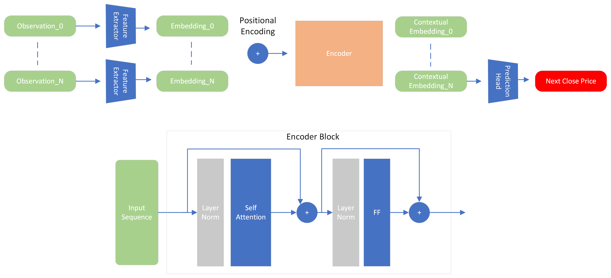
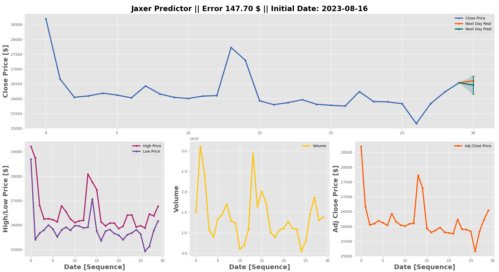
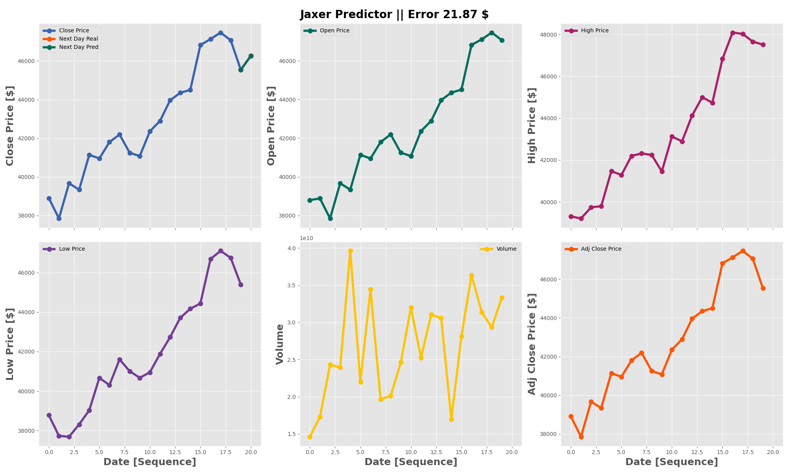

# JAXER
Jax and Flax Time Series Prediction Transformer. The goal of this repo is to learn [**Jax**](https://jax.readthedocs.io/en/latest/) and [**Flax**](https://flax.readthedocs.io/en/latest/) by implementing a deep learning model. I just wanted to test the easyness, speed and robustness of this new libraries compared to PyTorch or Tensorflow. 

In this case, a **transformer** for time series prediction. I have decided to predict BTC due to the availability of the data. However, this could be used for any other time series data, such as market stocks.

The current logo was created by DALLE-3 from OpenAI using the following prompt:
```
Render of a transformer model as a hologram, projecting from a digital device, with a faint BTC logo in the holographic projection, without any text.
```


## Roadmap
- Download BTC dataset ✔️
- Create a dataset class ✔️
- Add normalizer as dataset output ✔️
- Create the trainer class ✔️
- Train the model:
    - **Encoder** only (next day prediction) ✔️
    - **Encoder + Decoder** (N days predictions)
- Create an agent that loads the model and act as a predictor ✔️
- Add a logger to the trainer class ✔️
- Add a lr scheduler to the trainer class: warmup cosine scheduler ✔️

## Installation

Clone the repo:
```bash
git clone https://github.com/rsanchezmo/jaxer.git
cd jaxer
```

Create a python venv:
```bash
python -m venv venv
```

Install your desired jax version. For example, for CUDA 12 on Linux:
```bash
pip install jax[cuda12_pip] -f https://storage.googleapis.com/jax-releases/jax_cuda_releases.html
```

Then install the rest of the dependencies:

```bash
pip install .
```

## Description
### Dataset 
The dataset has been downloaded from [Yahoo Finance](https://es.finance.yahoo.com/quote/BTC-USD?p=BTC-USD&.tsrc=fin-srch). The time resolution is a day to avoid any preprocessing to fill missing timesteps. There is a ```.csv``` with all de BTC-USD data. 

The available information is:
- Low/High price
- Open/Close price
- Volume
- Adjusted close price

The dataset is implemented in PyTorch due to the easyness of creating a dataloader. However, as we are working with jax arrays, it was necessary to pass a function to the dataloader to map the torch tensors to jax.ndarrays. 

### Model

#### Encoder Only


Model is implemented in Flax. Feature extractors and prediction head consist on an MLP with residual blocks and layer normalization. The encoder consists on L x Encoder blocks with self attention. layer norms and feedforwarding. The output of the encoder is flattened to feed the prediction head. Each token of the output sequence contains the "context" of the others related to itself. 

We could get the last token instead of flattening the encoder output, but as we are not masking the attention, each contextual embedding can be valuable for the prediction head. However, this is something I am exploring these days. The need to mask the attention, and if not, the need to use the positional encoding.  

## Usage
### Training
Set the configuration parameters in the `training_config.py` file. The training is made really easy:

```python
from jaxer.utils.trainer import FlaxTrainer as Trainer
from training_config import training_config

trainer = Trainer(config=training_config)
trainer.train_and_evaluate()
```

### Inference
An agent class has been created so you can load a model and use it to predict to any data you want. 

```python
from jaxer.utils.agent import Agent
import jax.numpy as jnp

# the experiment in the "results" folder
agent = Agent(experiment_name="exp", model_name="2") 

# a random input
x_test = jnp.ones((1, agent.config.model_config["max_seq_len"], agent.config.model_config["input_features"]))

# predict
pred = agent(x_test)
```

## Results
In order to analyze and compare results, several metrics have been considered:
- **MSE**: Mean Squared Error
- **MAE**: Mean Absolute Error
- **R2**: R2 Score

The best results are shown in the following table. The evaluation is computed on the test set which is the 20% of the whole dataset.
| Model | MSE | MAE | R2 |
|:-------:|:-----:|:-----:|:----:|
| Encoder | 0.0296 | 0.1116 | 0.7671 |
| Encoder + Decoder | - | - | -      |


Some of the predictions are shown below:






## Conclusions
- Jax and Flax are easy to use once you learn the basics. I have tried to make the code as simple as possible so it can be easily understood, encapsulating the complexity of the libraries.
- The model is not able to predict very accurately the price of BTC. It may be related to the scarcity of the variables used to predict the price. It would be interseting to add some market news or other variables to the model.
- The general idea from this repo is that the transformer can be applied to time series prediction, and can be implemented with state of the art libraries such as Jax and Flax from DeepMind. 

## Future Work
- Compare the model against other models such as LSTM or GRU.
- Add more variables to the model to improve accuracy such as market sentiment analysis. 
- Compare speed and performance against other libraries such as PyTorch or Tensorflow.

## Contributors
Rodrigo Sánchez Molina
- Email: rsanchezm98@gmail.com
- [Linkedin](https://www.linkedin.com/in/rsanchezm98/)
