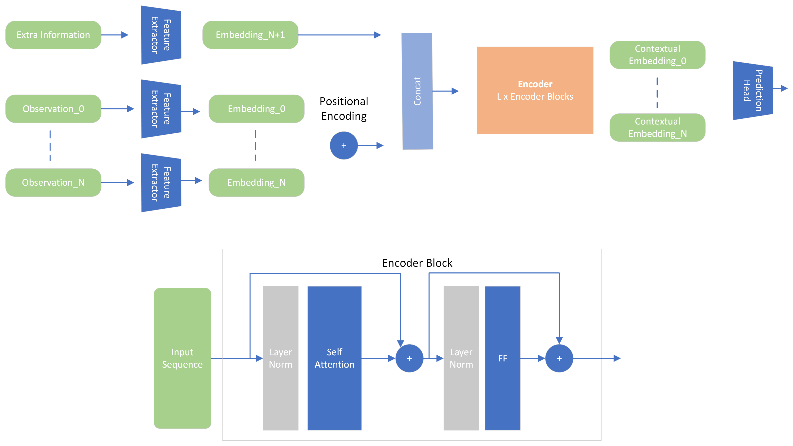

.. _model:

Model
=====

In this section, we delve into the model and its peculiarities. Firstly, an **encoder-based transformer** was chosen because the
interest was in predicting the **next token rather than a sequence in an autoregressive** manner. If that were the case,
an encoder-decoder approach would have been used, as the **encoder would provide context** and the **decoder would provide
autoregressivity** to the model regarding the predictions.

.. _backbone:

Backbone
---------
In this section, the common architecture of the model among the three approaches is shown. I won't delve too much into detail because
I assume that at this point, you're familiar with the transformer architecture. If not, take a look at the paper
`Attention is All You Need <https://arxiv.org/abs/1706.03762>`_.

Before passing through the encoder, a feature extractor has been integrated, which calculates embeddings with size d_model.
I could have **quantized** the input sequence timepoints to reduce the dimensionality (continuous to discrete), then get an **integer token** and pass it through
an **embedding layer** (same as with language). In fact, I followed that approach with :code:`extra_tokens`. Which where actually not sequences but
extra information that could be added to the transformer input. For instance, the **std of the window**, the **sentiment score**...

As we are working merely with **sequences**, we need a way to represent the position of each token in the sequence. That is because
attention mechanisms are permutation invariant (it computes a weighted sum of the input tokens). To solve this, I have implemented
the **absolute positional encoding** as described in the paper. Additionally, I have integrated `Time2Vec <https://arxiv.org/abs/1907.05321>`_,
which claims to be a **powerful representation of time** (it computes a **linear** and a **sinusoidal** representation of time).
It can be interesting for cryptocurrencies because behaviour of price 2 years ago may not be the same as the behaviour of current price.

Extra information that is not sequence-related can be added to the model. Must compute an embedding of size d_model and add it to the
sequence embeddings by concatenating them. As they are not sequence-related, they are not added a positional encoding.

The encoder is composed of **N** layers, each of which is composed of a **multi-head self-attention** mechanism and a **feed-forward
network**. The output of the encoder is a sequence of vectors, each of which represents the extracted information of the input token at that
position. Therefore, we need to **flatten**, **average** or get the **last item** of the sequence to get a single vector
that will feed the prediction head. This is the same for all three approaches. This is configurable in the model's configuration file.

.. code-block:: python

    (batch_size, sequence_length, d_model) -> (batch_size, d_model)

.. raw:: html

   
<em>Jaxer's backbone</em>

Model has been implemented using the compact version of :code:`flax` (`setup vs compact <https://flax.readthedocs.io/en/latest/guides/flax_fundamentals/setup_or_nncompact.html>`_) which allows to define the layers of the module inside the
:code:`__call__` method. The :code:`setup` method is more :code:`torch` alike. Example of the implementation of :code:`FeedForward` block:

.. code-block:: python

    class FeedForwardBlock(nn.Module):
        """ Feed Forward Block Module (dense, gelu, dropout, dense, gelu, dropout)

        :param config: transformer configuration
        :type config: TransformerConfig

        :param out_dim: output dimension
        :type out_dim: int
        """
        config: TransformerConfig
        out_dim: int

        @nn.compact
        def __call__(self, x: jnp.ndarray) -> jnp.ndarray:
            """ Applies the feed forward block module """

            x = nn.Dense(
                features=self.config.dim_feedforward,
                dtype=self.config.dtype,
                kernel_init=self.config.kernel_init,
                bias_init=self.config.bias_init,
            )(x)
            x = nn.gelu(x)
            x = nn.Dropout(rate=self.config.dropout)(
                x, deterministic=self.config.deterministic
            )
            x = nn.Dense(
                features=self.out_dim,
                dtype=self.config.dtype,
                kernel_init=self.config.kernel_init,
                bias_init=self.config.bias_init,
            )(x)
            x = nn.gelu(x)
            x = nn.Dropout(rate=self.config.dropout)(
                x, deterministic=self.config.deterministic
            )

            return x

.. _mean prediction:

Mean prediction
---------------

This is the most basic approach, and it consists of having a single neuron in the last layer of the prediction head.
The prediction backbone is identical across the three approaches, and I will explain it only once here.

Prediction head consists on a **set of dense layers** or **residual blocks** (if residual connections are enabled) that map
:code:`(batch_size, d_model)` to :code:`(batch_size, 1)`. The output of the model is the mean of the sequence, which is the actual
prediction.

Loss Function
~~~~~~~~~~~~~
I have decided to use the **mean squared error**. It is the most common loss function for regression
problems, and it is defined as:

.. math::

    \text{MSE} = \frac{1}{n} \sum_{i=1}^{n} (y_i - \hat{y}_i)^2

Where :math:`y_i` is the actual value and :math:`\hat{y}_i` is the predicted value. However, there are other loss functions
that could be used such as the **mean average percentage error** or the **huber loss**.

The :code:`jax` implementation of the loss function is:

.. code-block:: python

    @jax.jit
    def mse(y_pred: jnp.ndarray, y_true: jnp.ndarray) -> jnp.ndarray:
        """ Mean Squared Error """
        return jnp.mean(jnp.square(y_true - y_pred))

.. note::
    :code:`@jax.jit` decorator is used to compile the function to make it faster. Thanks to XLA, the function is compiled and
    acts like a graph. Not every function can be :code:`jitted`. More information
    about :code:`@jax.jit` can be found in the `jax documentation <https://jax.readthedocs.io/en/latest/notebooks/thinking_in_jax.html>`_.

.. _distribution prediction:

Distribution prediction
-----------------------
One thing I had in mind when designing the model was to be able to predict the **uncertainty**. :code:`How sure is
the model about the prediction?` This question is extremely important because in the financial world, it is not only important to predict the
price but also to know the confidence of it (as in computer deep learning object detection). To be clear, if the model predicts that price is going up
but it is not sure about it, it is not a good idea to take a decision based on that prediction.

As an assumption, next token is modelled as a **gaussian distribution**. Therefore, **mean** and the log of the **standard deviation** of the distribution must be computed.
Here, two approaches can be followed:

#. Using the **same layer** to predict both the mean and the log of the standard deviation.
#. Using **two different layers** to predict the mean and the log of the standard deviation.

Second approach has been implemented to let the model learn the appropriate weights for each output. The model can
focus more on different components on the input vectors (if the model wants to).

Loss Function
~~~~~~~~~~~~~
The loss function is the **negative log likelihood** of the predicted distribution. It is defined as:

.. math::

    \text{NLL} = -\log p(y | \mu, \sigma^2)

Where :math:`\mu` is the mean and :math:`\sigma^2` is the variance of the distribution (:code:`gaussian`). The loss function is the sum of the
log likelihood of the predicted distribution. The **negative log likelihood** is the most common loss function for distribution.

I did not add the **KL divergence** to the loss function, but as it measures how different two distributions are, it could be
interesting to add it to the loss function.

The :code:`jax` implementation of the loss function is:

.. code-block:: python

    @jax.jit
    def gaussian_negative_log_likelihood(mean: jnp.ndarray, std: jnp.ndarray, targets: jnp.ndarray,
                                         eps: float = 1e-6) -> jnp.ndarray:
        first_term = jnp.log(jnp.maximum(2 * jnp.pi * jnp.square(std), eps))
        second_term = jnp.square((targets - mean)) / jnp.clip(jnp.square(std), a_min=eps)
        return 0.5 * jnp.mean(first_term + second_term)

.. _classification prediction:

Classification prediction
-------------------------
This latest approach arose with the idea that **perhaps predicting the price directly might not be as interesting**,
given the complexity of the task with the amount of available data. Instead, it might be more efficient and make more
sense for a trader/bot to be able to **predict in which range of values the price will fall**. For example, determining that
the price will be in the range of +2 to +3% or that it will increase by more than 5%. To solve this, the problem needs to be
transformed into a **classification problem**.

The only thing we need to change is the output. We must define a set of **bins** that will represent the different ranges of
values that the price can take. Last layer must have as many neurons as bins, and shall be activated with a **softmax** function
to get the probabilities of the price being in each bin. The output of the model is the **argmax** of the probabilities.

Loss Function
~~~~~~~~~~~~~
The selected loss function is the **binary cross-entropy**. It is defined as:

.. math::

    \text{BCE} = -\frac{1}{N} \sum_{i=1}^{N} y_i \log(\hat{y}_i) + (1 - y_i) \log(1 - \hat{y}_i)

Where :math:`y_i` is the actual value and :math:`\hat{y}_i` is the predicted value. The **binary cross-entropy**
penalizes models based on the difference between the predicted probability and the true label. The goal is that every
prediction probability falls close to 1 for the true class and close to 0 the
other ones.

The :code:`jax` implementation of the loss function is:

.. code-block:: python

    @jax.jit
    def binary_cross_entropy(y_pred: jnp.ndarray, y_true: jnp.ndarray, eps: float = 1e-6) -> jnp.ndarray:
        """ Binary Cross Entropy """
        return jnp.mean(-y_true * jnp.log(y_pred + eps) - (1 - y_true) * jnp.log(1 - y_pred + eps))

Results with the three approaches are shown in the :ref:`results` section.

Model Configuration
-------------------
To configure the model, a configuration object must be filled:

.. code-block:: python

    d_model: int  # dimension of the model
    num_layers: int  # number of encoder layers
    head_layers: int  # number of layers in the head
    n_heads: int  # number of attention heads
    dim_feedforward: int  # dimension of the feedforward network
    dropout: float  # dropout rate
    max_seq_len: int  # maximum sequence length (context window)
    flatten_encoder_output: bool  # flatten the encoder output
    fe_blocks: int  # number of feature extractor blocks
    use_time2vec: bool  # use time2vec
    output_mode: str  # output mode (mean, distribution, discrete_grid)
    use_resblocks_in_head: bool  # use residual blocks in the head
    use_resblocks_in_fe: bool  # use residual blocks in the feature extractor
    average_encoder_output: bool  # average the encoder output (if flatten_encoder_output is False)
    norm_encoder_prev: bool  # normalize the encoder output before the attention mechanism or after