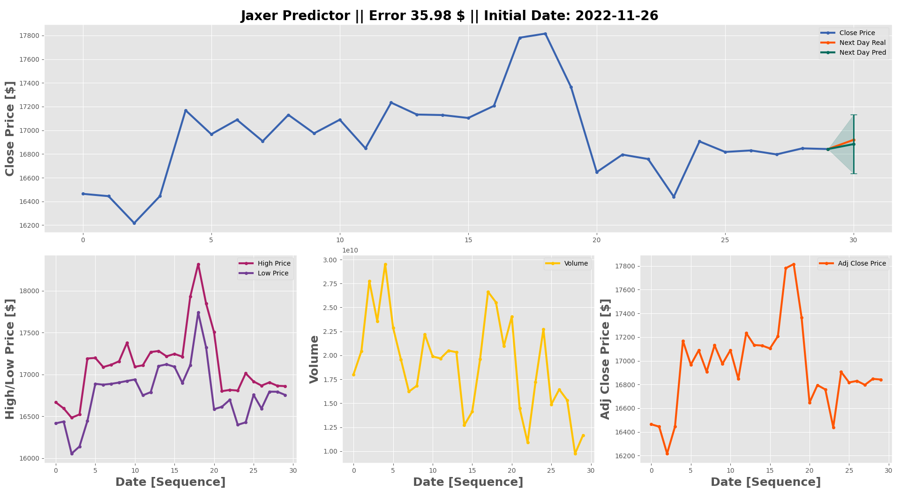
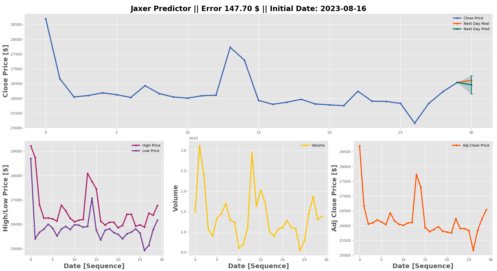
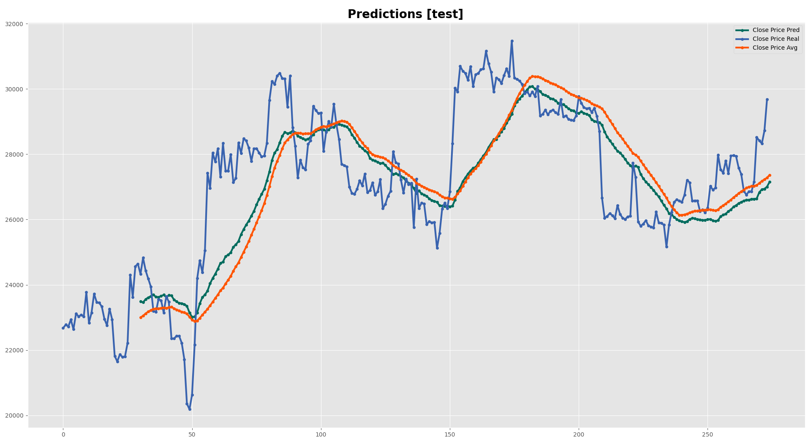
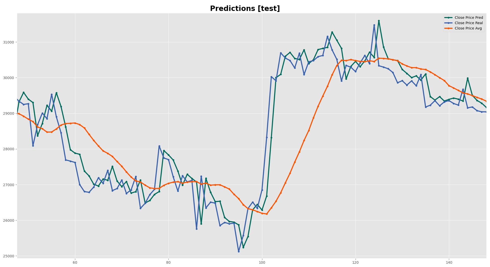
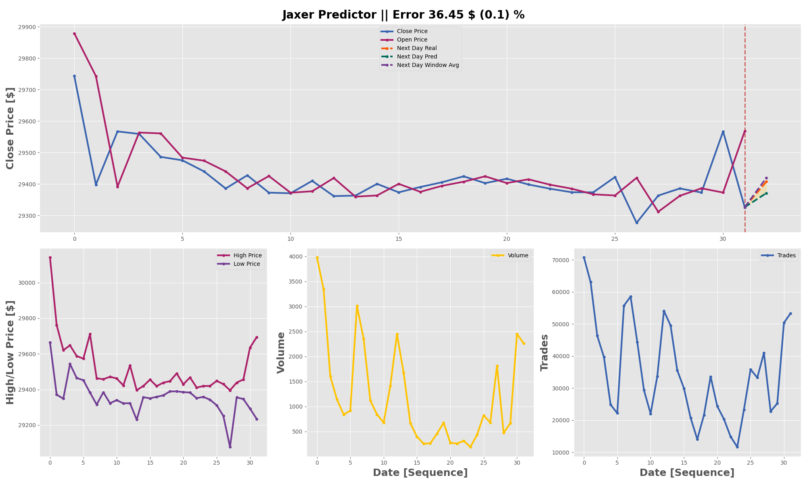
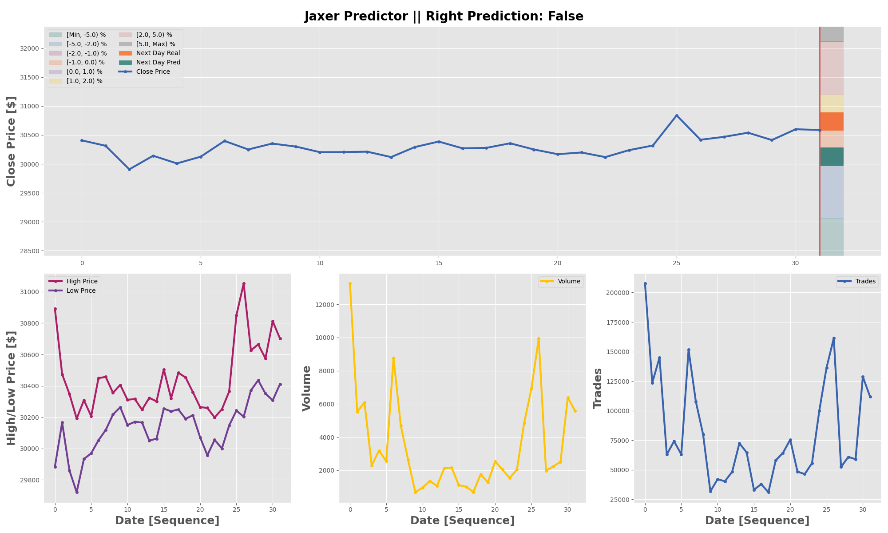
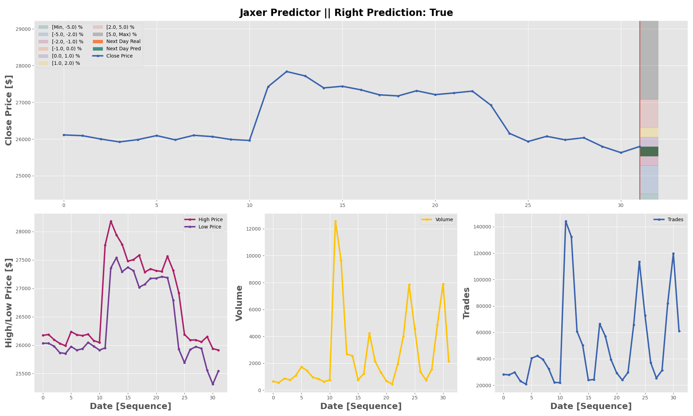

.. _results:

Results
=======

In this section, some of the results are presented for each of the model variations. Final conclusions are also depicted.

Output Distribution
-------------------

As we are predicting a distribution, the 95% confidence interval is shown in the plots to have a better understanding of the uncertainty of the model. The upper and lower bounds are computed as [mean + 1.96*std, mean - 1.96*std] respectively.

Now, the model is either predicting the window mean or lagging the input sequence. It is related to model size and hp and hope to fix it soon.

Output Mean
-----------

Output Discrete Grid
--------------------

Conclusions
-----------
