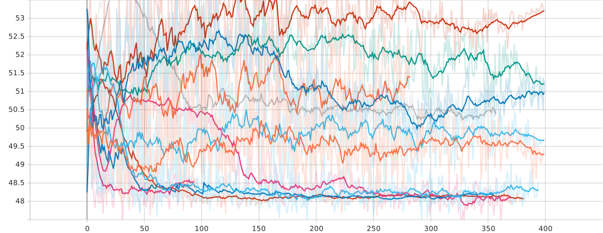
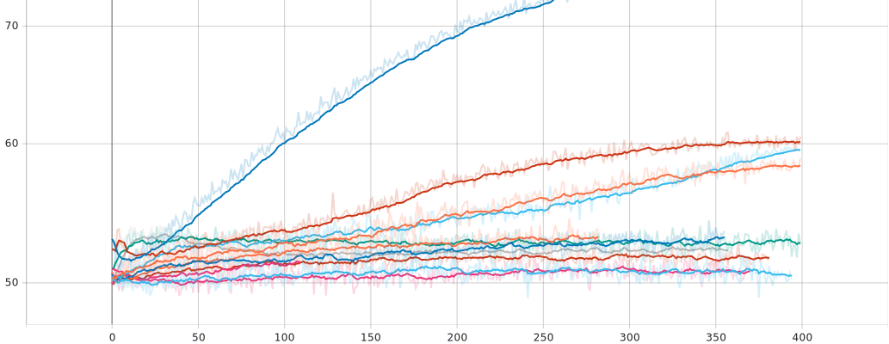
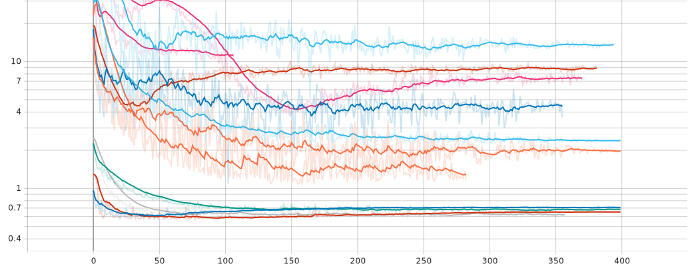
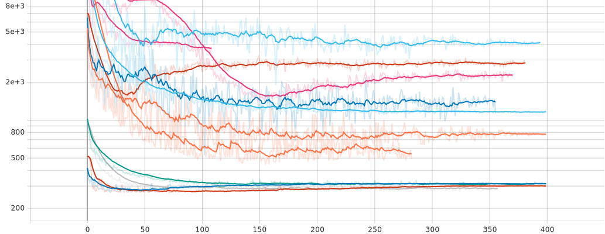
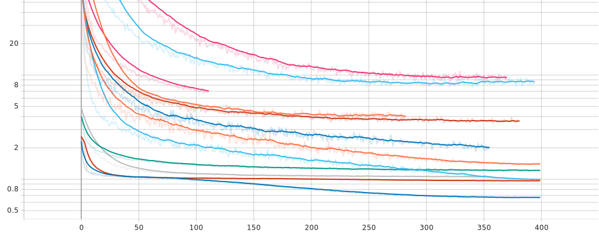
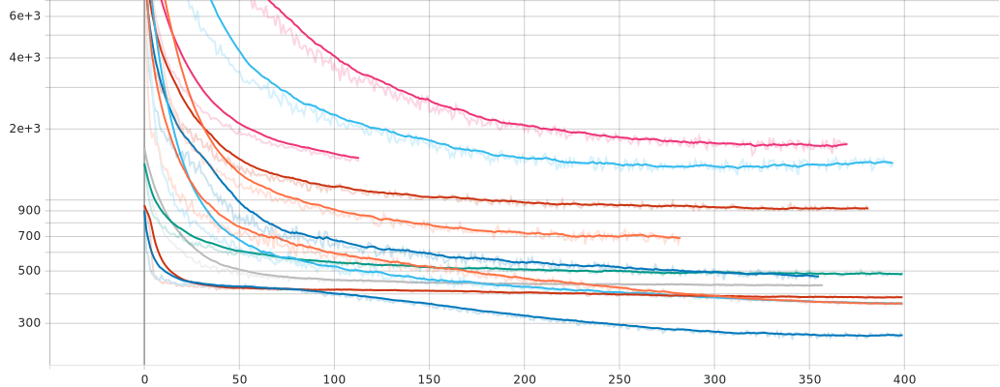
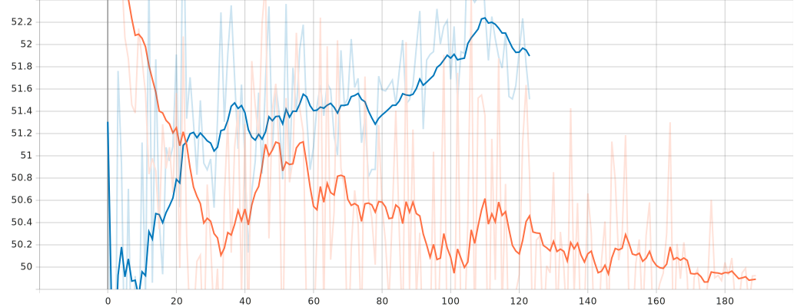
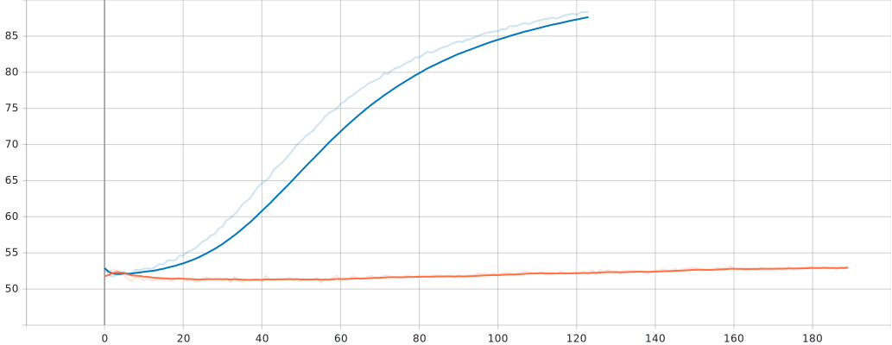

.. _results:

Results
=======

Hardware
--------
The code was run on my laptop which has an :code:`Intel Core i9-13900H CPU @ 5.4GHz` with :code:`32GB of RAM` and a
:code:`NVIDIA RTX 4070 8GB GPU`.
As you will see on the :ref:`conclusions` section, **this was my biggest bottleneck**, even though it is a very powerful machine.

To get a **representative study** over each model, I run the **hyperparameter search** for :code:`N` experiments (N adapted to the computation time and HW of my laptop)
over a set of hyperparameters. Metrics were computed during training only on :code:`'btc_usd'` ticker, even if trained with
all tickers. :code:`EarlyStopper` was used to save time by stopping the training when the model stops improving for a fixed number of epochs. A test ration of 0.15
was used to validate the model (:code:`0.15` of the data of each ticker was used for validation and :code:`0.85` for training).

Mean Prediction
---------------
An initial study was done with :code:`btc_usd` ticker only and :code:`4h resolution`, to get a sense of the performance of the model and a baseline to start with.
As :code:`4h 'btc_usd'` dataset is only :code:`13131` samples long, a strong **overfitting** was expected. The :code:`hp_search` is depicted below:

.. raw:: html

    
<em>Test acc_dir</em>

.. raw:: html

    
<em>Train acc_dir</em>

As you can see, the model's ability to predict the direction of the price in the test set is **really bad**, :code:`50%` accuracy, which is the same as a **random guess**. However, :code:`mape` and :code:`rmse` are not that bad.
This can be confusing because you may think that the model is quite good by only committing really small errors, but the truth is that the model has no intuition about where the price will go.

.. note::

    Using :code:`acc_dir` as a metric was really enlightening and it is really curious why it is not used in the literature. People may think their models are good enough and they are not.

.. raw:: html

        
<em>Test mape (%)</em>

.. raw:: html

        
<em>Test rmse ($)</em>

.. raw:: html

        
<em>Train mape (%)</em>

.. raw:: html

        
<em>Train rmse ($)</em>

I then run a training with :code:`btc_usd` and :code:`eth_usd` tickers and :code:`1h resolution` to see if the model could generalize better. Now, we have about 80k (40k points each in the train set),
but again, we end up **overfitting**.

.. raw:: html

        
<em>Test acc_dir</em>

.. raw:: html

        
<em>Train acc_dir</em>

This made me think that we should **scale things up**. I downloaded more tickers such as :code:`sol_usd` and trained with
:code:`30m resolution` and all tickers. Dataset length is now up to :code:`208751` windows for training and :code:`14999` for test. I really would be happy if the :code:`test_acc_dir` went above :code:`60%`. This would be
a really good indicator that the model is able to find some patterns in the data that can be used to guess the direction of the price.
Scaling up the system, made the training become much slower with the same HW, so debugging and making guesses about where to move next
gets harder. I actually decided to change :code:`test_ratio` to :code:`0.1` to have more data for training and reduce the starve of the model.

Distribution Prediction
-------------------------
TBC

Classification Prediction
-------------------------
TBC

.. _conclusions:

Conclusions
-----------
TBC